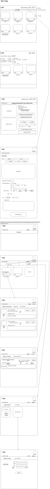

## Team Parking Sniffer Proposal  
 
### Elevator Proposal:  
A person to person parking app that connects users in an area that need parking with users in an area offering parking. App utilizes Google Maps to allow searches in a set area. Owners of parking spaces set their own price and set restrictions on type of car and range of stay. 
 
### Features:  
1)   User authentication and validation. Users are both buyers and sellers.  
2)  Parking spaces are separated into several categories (available car types, covered/uncovered, secure/not secured, etc.)  
3)  Making a reservation automatically makes the necessary associations in the database 
4)  Search bar utilizes Google Maps and integrates with our API for targeted search 
anywhere in the US. 
 
### Technologies: 
1)  MERN Stack: (Mongo, Express.js, React, Node.js) 
2)  Google MAPS API  
 
### Timeline:  
1) Weekend  
a) Recover from Javascript project (Friday night). 
b) Research existing parking applications for standards. 
c) Research and learn MongoDB, Express.js, and Google Maps (Saturday). Begin implementing skeleton 
d) Begin User auth and create basic database. Setup shared github repo. Distribute tasks for the rest of the week. (Sunday) 

2) Monday  
a) Stub out landing page and dashboard 
b) Create Google Maps implementation 
c) Complete User auth 
d) Write and test all necessary APIs. 

3) Tuesday - Wednesday  
a) Create normalized state  
b) Create and test associations between tables  
c) Finish seed data  
d) Flesh out all necessary pages 

4) Thursday - Friday  
a) Finalize database  
b) Style all pages  
 
 
 
5) Saturday  
a) Finish any unfinished projects  
6) Sunday  
a) Relax. Have a big brunch. Find a good mimosa place nearby. 
 
 
### Study materials:  
1) Udemy MERN tutorial: ​https://www.udemy.com/mern-stack-front-to-back/  

2) Google Maps API documentation  

### Wireframes
